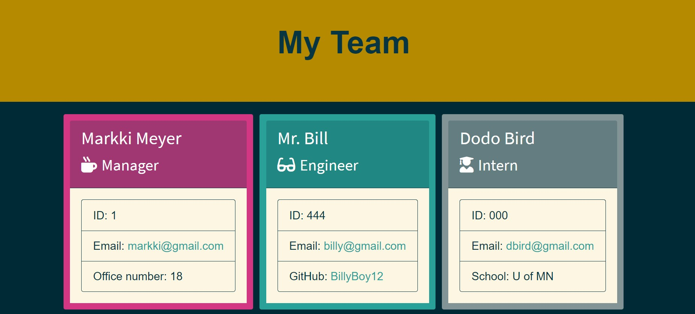

# Team Generator

 

## Description

This application runs in the command line and prompts the user for employee information in order to generate a mobile-responsive HTML page with content for each team member. 

## Installation
Begin by installing jest and inquirer dependencies.

## Usage
From the command line of the terminal, type "node app2.js" to run the app. Answer the prompts, which include specific questions regarding Manager, Engineer, and Intern employee roles. When complete, answer "No" to the prompt, "Would you like to add an employee?" This will console log "Employee(s) Added" and the team.html will be ready to view in the browser as a stylish layout of your team. 

Example of prompts: 

 

 ## Testing

 From the command line, type "npm test" to confirm this app successfully passes the provided tests. 

 
 
## Demo
Watch the demo video on YouTube [here](https://youtu.be/bLPoDc9HEe4).
